**1.Create (Add) A Product (POST):**

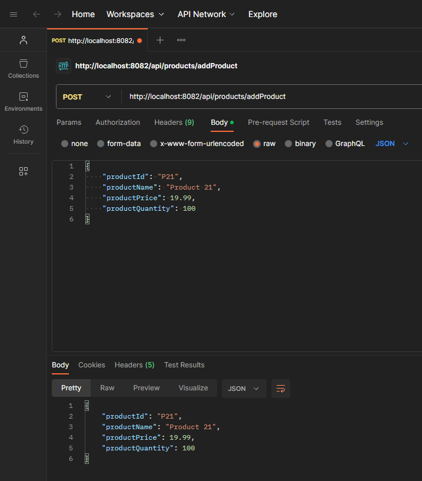

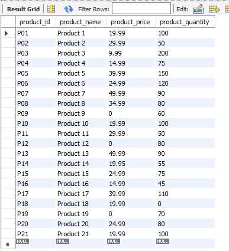

**2.Retrieve a Product By productId (GET):**

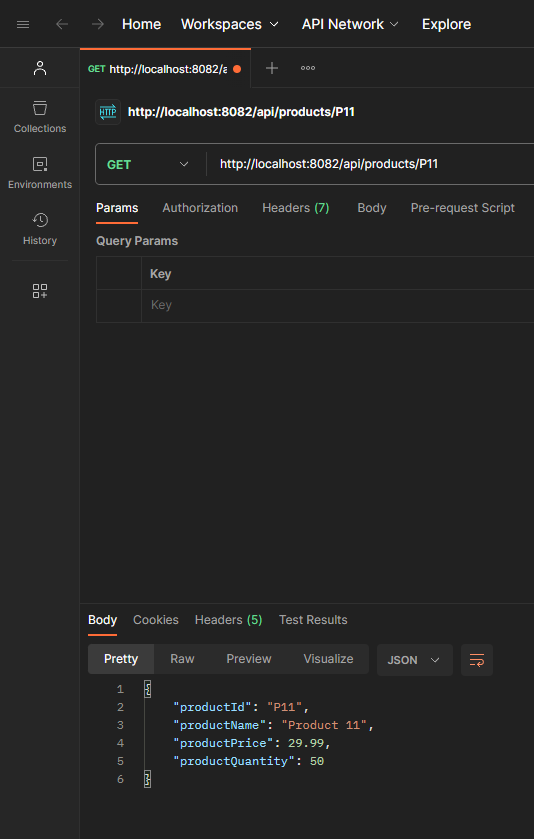

**3.Retrieve All Products (GET):**

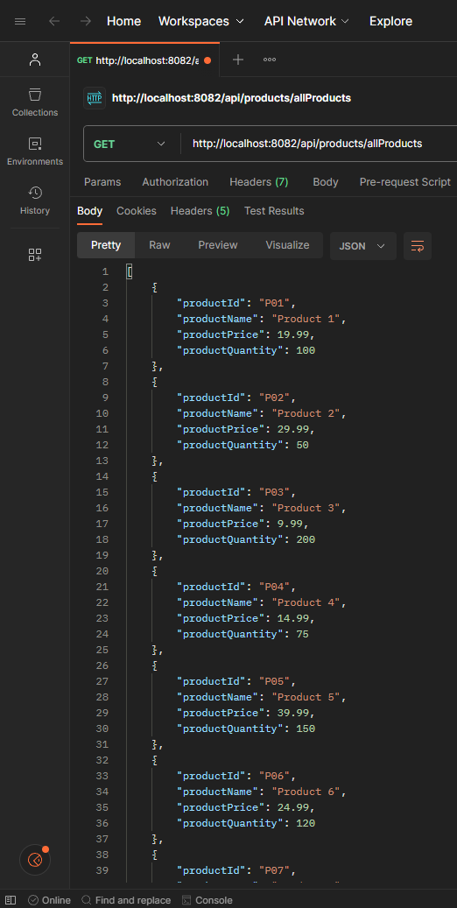

**4.Update Product Name (PATCH):**

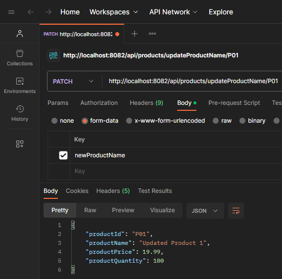

**5.Update Product Price (PATCH):**

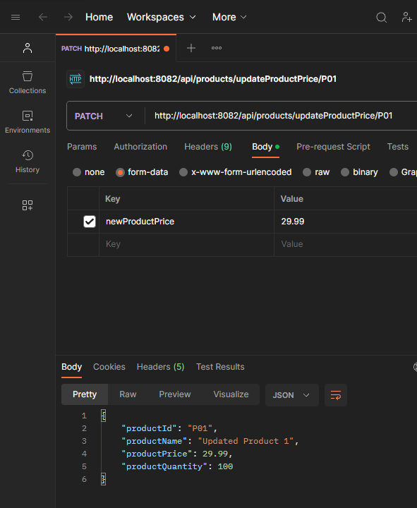

**6.Update Product Quantity (PATCH):**

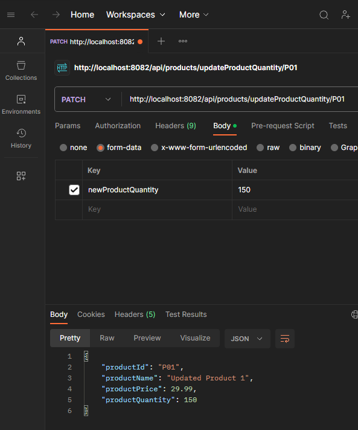

**7.Delete A Product By productId (DELETE):**

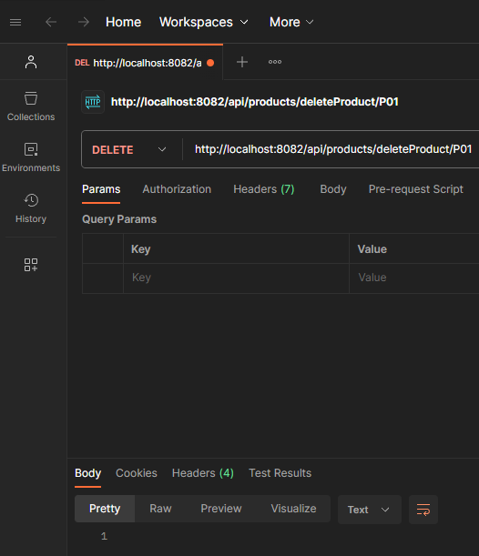

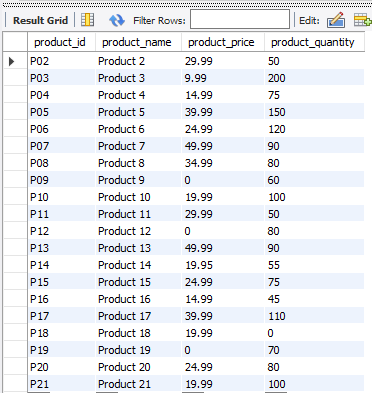

**Ques 1. Find All Products With Price Greater Than Specified Value**

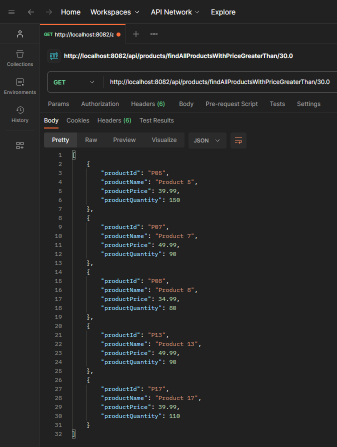

**Ques 2. Find All Products With Price In Between Specified Price Range Values**

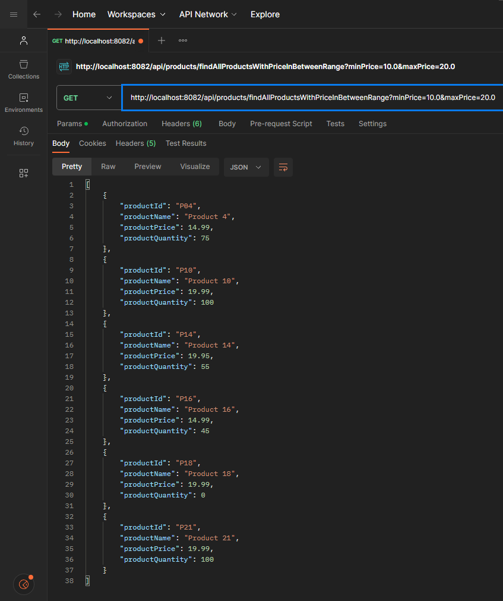

**Validations On ProductId Length, Product Price & Product Quantity**

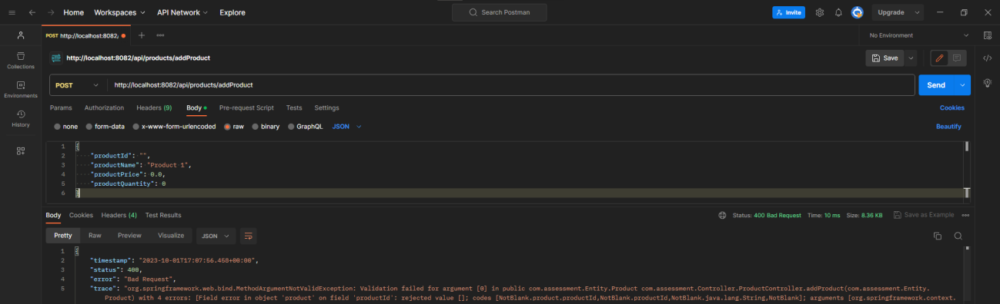

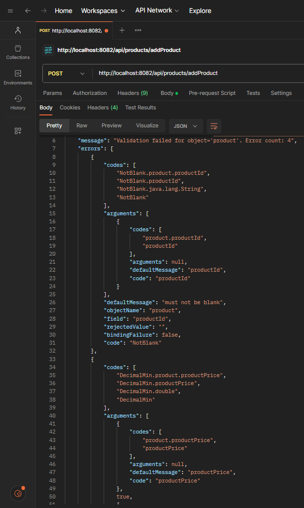

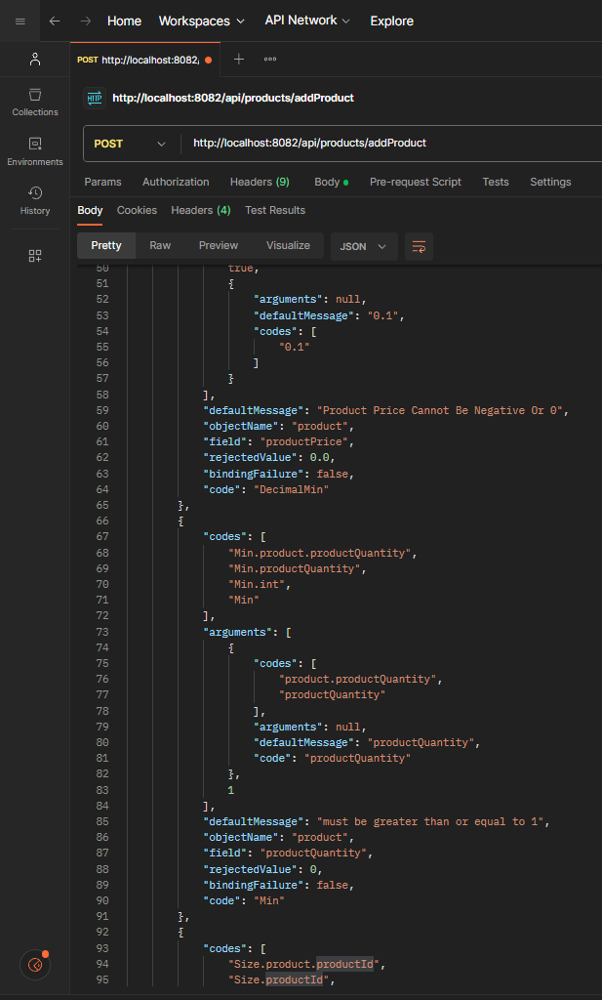

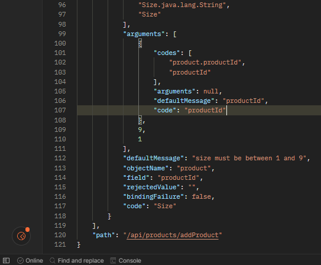
